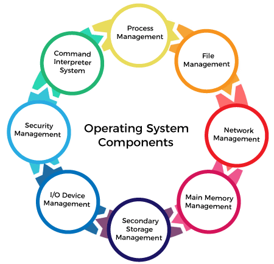
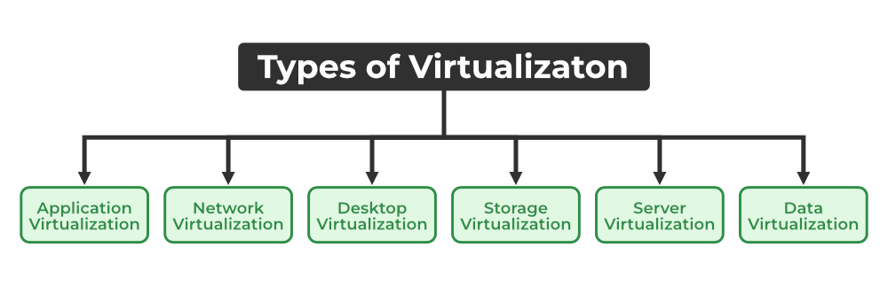

# Operating System
The operating system (OS) is the program that controls all other applications on the computer after it is loaded onto the computer from the bootloader. Applications use the operating system by requesting services through an application programming interface (API). Often, there are many different computer programs running at the same time, all of which require access to your computer's central processing unit (CPU), memory, and storage. The operating system manages all of this to ensure that each program gets what it needs. 
The kernel is the software that contains the operating system’s core components. To run other programmes, every computer has to have at least one operating system installed. Windows, Linux, and Android are examples of operating systems that enable the user to use programs like MS Office, Notepad, and games on the computer or mobile phone. It is necessary to have at least one operating system installed in the computer to run basic programs like browsers.

## Functions of an Operating System
**Resource Management**: The operating system manages and allocates memory, CPU time, and other hardware resources among the various services and processes running on the computer.
**System Management**: The operating system is responsible for starting, stopping and managing processes and tasks. It also manages the scheduling of processes and allocates resources to them.
**Memory Management**: The operating system manages the computer's main memory and provides a mechanism to optimize memory usage.
**Security**: The operating system provides users with a secure environment, applications, and data using security policies and procedures such as control and access.
**Job Statistics**: Track time and resources used by various tasks or users.
**File management**: The operating system is responsible for organizing and managing the file system, including creating, deleting and executing files and directories.
**Device Management**: The operating system manages input/output devices such as printers, keyboards, mice and monitors. It provides the necessary drivers and interfaces to ensure communication between the device and the computer.
**Network**: The operating system provides network functions such as creating and managing network connections, maintaining network policies, and sharing resources such as printers and files on the network. network.
**User Interface**: The operating system provides a user interface that allows users to interact with the computer. This can be a graphical user interface (GUI), a command line (CLI), or a combination of both.
**Backup and Recovery**: The operating system provides a mechanism to backup and restore data when the system fails, makes errors, or becomes damaged.
**Virtualization**: The operating system provides virtualization capabilities that allow multiple operating systems or applications to be run on a single physical machine. This makes the use of resources efficient and easy in managing operations.
**Performance monitoring**: The operating system provides tools for monitoring and improving performance, including identifying bottlenecks, optimizing resource usage, and performing log and metrics analysis.
**Time sharing**: The operating system provides time sharing that distributes resources fairly and well, allowing multiple users to share the computer and its resources at the same time.
**System calls**: The operating system provides system calls that allow applications to interact with the system and access its resources. Search provides a standard interface between applications and operating systems, allowing mobility and compatibility across different hardware and software platforms.
**Error-detecting Aids**: There are methods for creating dumps, system, error messages, and other debugging and error detection.

## Components of an Operating System

    Process Management
    File Management
    Network Management
    Main Memory Management
    Secondary Storage Management
    I/O Device Management
    Security Management
    Command Interpreter System
## Types of Operating System

**Batch Operating System**: A Batch Operating System is a type of operating system that does not interact with the computer directly. There is an operator who takes similar jobs having the same requirements and groups them into batches.
**Time-sharing Operating System**: Time-sharing Operating System is a type of operating system that allows many users to share computer resources (maximum utilization of the resources).
**Distributed Operating System**: Distributed Operating System is a type of operating system that manages a group of different computers and makes it appear to be a single computer. These operating systems are designed to operate on a network of computers. They allow multiple users to access shared resources and communicate with each other over the network. Examples include Microsoft Windows Server and various distributions of Linux designed for servers.
**Network Operating System**: Network Operating System is a type of operating system that runs on a server and provides the capability to manage data, users, groups, security, applications, and other networking functions.
**Real-time Operating System**: Real-time Operating System is a type of operating system that serves a real-time system and the time interval required to process and respond to inputs is very small. These operating systems are designed to respond to events in real time. They are used in applications that require quick and deterministic responses, such as embedded systems, industrial control systems, and robotics.
**Multiprocessing Operating System**: Multiprocessor Operating Systems are used in operating systems to boost the performance of multiple CPUs within a single computer system. Multiple CPUs are linked together so that a job can be divided and executed more quickly.
**Single-User Operating Systems**: Single-User Operating Systems are designed to support a single user at a time. Examples include Microsoft Windows for personal computers and Apple macOS.
**Multi-User Operating Systems**: Multi-User Operating Systems are designed to support multiple users simultaneously. Examples include Linux and Unix.
**Embedded Operating Systems**: Embedded Operating Systems are designed to run on devices with limited resources, such as smartphones, wearable devices, and household appliances. Examples include Google’s Android and Apple’s iOS.
**Cluster Operating Systems**: Cluster Operating Systems are designed to run on a group of computers, or a cluster, to work together as a single system. They are used for high-performance computing and for applications that require high availability and reliability. Examples include Rocks Cluster Distribution and OpenMPI.

# LINUX
Linux is an open source operating system (OS). An operating system is the software that directly manages a system's hardware and resources, like CPU, memory, and storage. The OS sits between applications and hardware and makes the connections between all of your software and the physical resources that do the work.

The Linux Operating System comprises of:
**Bootloader** - It's the software that controls the computer's boot process. For most users, this is a pop-up splash screen that eventually disappears to boot into the operating system.
**Kernel** - The kernel is the core of the system and controls the CPU, memory, and peripherals. Kernel is the lowest level of an operating system.
**Init system** - This is the subsystem that boots up the user interface and is responsible for managing daemons. Systemd is one of the most used init systems but also one of the most controversial. When the bootup is pushed from the bootloader (i.e. GRUB or GRand Unified Bootloader), the startup program controls the boot process.
**Daemons** - These are background services (printing, sound, scheduling, etc.) that are started during boot or after entering the desktop.
**Graphical Server** - This is the subsystem that displays graphics on the monitor. It is often referred to as X server or just X.
**Desktop Environment** - This is where the user interacts. There are many desktop environments to choose from (GNOME, Cinnamon, Mate, Pantheon, Enlightenment, KDE, Xfce, etc.). Every desktop environment has built-in applications (such as file managers, configuration tools, web browsers, and games).
**Applications** – There is no complete set of applications in the desktop environment. Just like Windows and macOS, Linux has thousands of great software that's easy to find and install. Most modern Linux distributions (more on that below) include an App Store-like tool that manages and simplifies app installation. For example, Ubuntu Linux has the Ubuntu Software Center (the name of GNOME Software), which allows you to search for thousands of applications and install them from a central location.

# Server

A server is a computer or device that provides services to other computers and their users (also known as clients). In a data center, the physical computer that runs the service server is also often called a server. The term server can refer to a physical machine, a virtual machine or to software that is performing server services. The machine can be a dedicated server or used for other purposes. Servers manage network resources. For example, a user may set up a server to control access to a network, send/receive email, manage print jobs, or host a website. They are also proficient at performing intense calculations. 

Some servers are committed to a specific task or one website, often called dedicated servers. However, many servers today are shared servers that take on the responsibility of e-mail, DNS (domain name system), FTP, and multiple websites in the case of a web server.
Most servers are never shut down because they are generally used to provide services that are needed on a regular basis. Therefore, having the server down can cause many problems for internet users and companies. To mitigate these problems, servers are commonly set up to be fault tolerant.

## Types of Server
Servers are often categorized in terms of their purpose. A few examples of the types of servers available are as follows:
**Web server**: a computer program that serves requested HTML pages or files. In this case, a web browser acts as the client.
**Application server**: a program in a computer in a distributed network that provides the business logic for an application program.
**Proxy server**: software that acts as an intermediary between an endpoint device, such as a computer, and another server from which a user or client is requesting a service.
**Mail server**: an application that receives incoming emails from local users [people within the same domain] and remote senders and forwards outgoing emails for delivery.
**Virtual server**: a program running on a shared server that is configured in such a way that it seems to each user that they have complete control of a server.
**Blade server**: a server chassis housing multiple thin, modular electronic circuit boards, known as server blades. Each blade is a server in its own right, often dedicated to a single application
**File server**: a computer responsible for the central storage and management of data files so that other computers on the same network can access them.
**Policy server**: a security component of a policy-based network that provides authorization services and facilitates tracking and control of files. 
**Database server**: this server is responsible for hosting one or more databases. Client applications perform database queries that retrieve data from or write data to the database that is hosted on the server.
**Print server**: this server provides users with access to one or more network-attached printers or print devices as some server vendors call them. The print server acts as a queue for the print jobs that users submit. Some print servers can prioritize the jobs in the print queue based on the job type or on who submitted the print job.

# Virtualization
Virtualization is the process of running a virtual instance of a computer system in a layer that abstracts it from the real hardware. In general, it means running more than one operating system simultaneously on a computer. Applications running on virtualized machines appear as if they were on their own machine, where operating systems, libraries, and other programs are specific to the guest virtualized system and follow the host machine on which they are running. The operating system is not connected below it.

There are many reasons why people utilize virtualization in computing. To desktop users, the most common use is to be able to run applications meant for a different operating system without having to switch computers or reboot into a different system. For administrators of servers, virtualization also offers the ability to run different operating systems, but perhaps, more importantly, it offers a way to segment a large system into many smaller parts, allowing the server to be used more efficiently by a number of different users or applications with different needs. It also allows for isolation, keeping programs running inside of a virtual machine safe from the processes taking place in another virtual machine on the same host.

## Types of Virtualization

**Application Virtualization**: Application virtualization helps a user to have remote access to an application from a server. The server stores all personal information and other characteristics of the application but can still run on a local workstation through the internet. An example of this would be a user who needs to run two different versions of the same software. Technologies that use application virtualization are hosted applications and packaged applications. 
**Network Virtualization**: The ability to run multiple virtual networks with each having a separate control and data plan. It co-exists together on top of one physical network. It can be managed by individual parties that are potentially confidential to each other. Network virtualization provides a facility to create and provision virtual networks, logical switches, routers, firewalls, load balancers, Virtual Private Networks (VPN), and workload security within days or even weeks. 
**Desktop Virtualization**: Desktop virtualization allows the users’ OS to be remotely stored on a server in the data center. It allows the user to access their desktop virtually, from any location by a different machine. Users who want specific operating systems other than Windows Server will need to have a virtual desktop. The main benefits of desktop virtualization are user mobility, portability, and easy management of software installation, updates, and patches. 
**Storage Virtualization**: Storage virtualization is an array of servers that are managed by a virtual storage system. The servers aren’t aware of exactly where their data is stored and instead function more like worker bees in a hive. It makes managing storage from multiple sources be managed and utilized as a single repository. storage virtualization software maintains smooth operations, consistent performance, and a continuous suite of advanced functions despite changes, breaks down, and differences in the underlying equipment. 
**Server Virtualization**: This is a kind of virtualization in which the masking of server resources takes place. Here, the central server (physical server) is divided into multiple different virtual servers by changing the identity number, and processors. So, each system can operate its operating systems in an isolated manner. Where each sub-server knows the identity of the central server. It causes an increase in performance and reduces the operating cost by the deployment of main server resources into a sub-server resource. It’s beneficial in virtual migration, reducing energy consumption, reducing infrastructure costs, etc.
**Data Virtualization**: This is the kind of virtualization in which the data is collected from various sources and managed at a single place without knowing more about the technical information like how data is collected, stored & formatted then arranged that data logically so that its virtual view can be accessed by its interested people and stakeholders, and users through the various cloud services remotely. Many big giant companies are providing their services like Oracle, IBM, At scale, Cdata, etc.

# Virtual Machine
A virtual machine is the simulated equivalent of a computer running on top of another system. A virtual machine can access all services: computing power through hardware services, but limited access to the host's CPU and memory; one or more physical or virtual storage devices; virtual or real network interfaces; and any devices shared with the virtual machine, such as graphics cards, USB devices, or other devices. If the virtual machine is stored on a virtual disk, it is often called a disk image. The disk image may contain information necessary to initialize the virtual machine or have other special requirements.

Organizations prefer using virtual machines due to the benefits of deploying virtual desktop infrastructure (VDI). VDI deployments help users and organizations access desktop environments like Linux and Windows. There are plenty of reasons to use virtual machines, and they offer several benefits, including efficient IT systems, security, scalability, and cost savings.

**Security**: Security is one of the primary reasons why businesses prefer using VMs over host machines. Virtual environments and operating systems are isolated within the host operating system. This helps boost the security of VMs and protects them from vulnerabilities, such as malware and cyberattacks, and makes VM an ideal choice for production tasks, including application and software testing. Disaster recovery is another major reason why organizations prefer VMs. Virtual machines can easily be reverted to older versions, deleted, and recreated.
**Cloud computing**: Organizations can take advantage of hybrid clouds by quickly deploying and migrating cloud-native virtual machines to on-premises servers and vice-versa. Businesses can tweak their cloud services in real-time to improve scalability depending on the requirements and varying usage levels. Additionally, developers can also create ad hoc virtual environments in the cloud using virtual machines to test their implementation.
**Cost efficiency**: One of the significant advantages of using virtual machines is that users can host multiple operating systems on a single server. Instead of investing in multiple operating systems, organizations can deploy one server and various applications, leveraging physical hardware at its maximum capacity, thereby improving cost efficiency.
**Scalability**: Deploying a virtual machine is as simple as creating copies of operating systems. All you need is a physical machine to install virtual operating systems and get started. Utilizing a virtual machine helps organizations respond better to fluctuations and help stabilize the performance of the teams. The process of installing a virtual machine is fast and efficient compared to installing different operating systems on other physical servers.

## Types of Virtual Machines
For installing different virtual operating systems, including Windows, Linux, and Mac on a host machine, you must use virtual machine software, such as Windows virtual machine software, Linux virtual machine software, Microsoft virtual machine software, virtual machine backup software, and more. Outlined below are the two most common types of virtual machines:

**System virtual machines**: System virtual machines provide full virtualization and act as a real machine. These VMs share and manage host hardware resources to function and execute the entire operating system, thereby creating multiple virtual environments on the host system. These multiple VMs are isolated and allow sharing of resources such as memory via memory pages. A system virtual machine requires a virtualization software known as a Virtual Machine Monitor (VMM) for its implementation.

**Process virtual machines**: These virtual machines are also known as application virtual machines and are used to run applications inside the operating system of a physical host. They offer high-level abstractions and platform-independent programming environments to the entire process. Moreover, they require interpreters or runtime software for their successful implementation and are also known as managed runtime environments. The best examples of process virtual machines are parallel virtual machines, message passing interface, and Java virtual machines used for Java programming.

## Virtualization and Virtual Machines
Virtualization can be defined as the process of creating virtual machines on a physical host server using software known as a hypervisor. A hypervisor can be defined as a virtual machine monitor to create and run VMs. It helps in operating multiple virtual machines as guests on a host server and makes it possible to maximize the use of the system's available resources such as CPU, network bandwidth, memory, and so on. A hypervisor can help you create an abstraction layer over the physical server to efficiently run multiple virtual servers, operating systems, and applications on it.
On the other hand, virtual machines act as individual machines with their own operating systems and applications but use the resources of their physical host to perform the functions.

# Hypervisor
A hypervisor is a form of virtualization software used in Cloud hosting to divide and allocate the resources on various pieces of hardware. The program which provides partitioning, isolation, or abstraction is called a virtualization hypervisor. The hypervisor is a hardware virtualization technique that allows multiple guest operating systems (OS) to run on a single host system at the same time. A hypervisor is sometimes also called a virtual machine manager (VMM). 
## Types of Hyervisor
    Type-1 Hypervisor
    Type-2 Hypervisor

**Type-1**: The hypervisor runs directly on the underlying host system. It is also known as a “Native Hypervisor” or “Bare metal hypervisor”. It does not require any base server operating system. It has direct access to hardware resources. Examples of Type 1 hypervisors include VMware ESXi, Citrix XenServer, and Microsoft Hyper-V hypervisor. 

**Type-2**: A Host operating system runs on the underlying host system. It is also known as ‘Hosted Hypervisor”. Such kind of hypervisors don't run directly over the underlying hardware, rather they run as an application in a Host system(physical machine). Basically, the software is installed on an operating system. Hypervisor asks the operating system to make hardware calls. An example of a Type 2 hypervisor includes VMware Player or Parallels Desktop. Hosted hypervisors are often found on endpoints like PCs.  The type-2 hypervisor is very useful for engineers, and security analysts (for checking malware, or malicious source code and newly developed applications).

